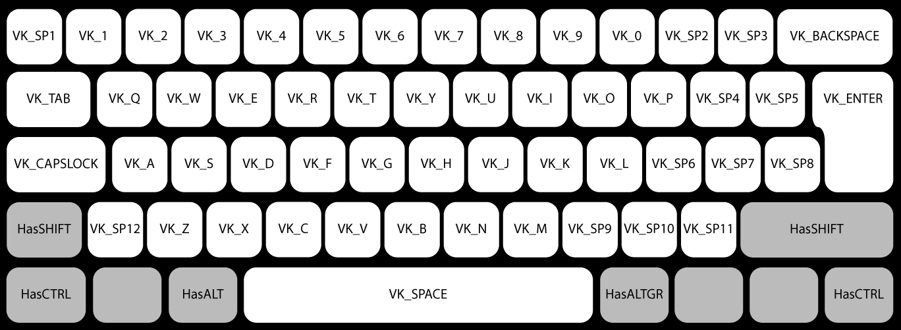

# keybd_event
This library simulates the key press on the keyboard.

**Important :** 
- The keys change in the different keyboard layout configuration of the target computer.
- I have tested this code on the different system and I don't find the error, but I don't granted this update have no bug. If you have a bug, please create an issue.

## For simulate key press in Linux, Windows and Mac in golang


### An example :
```go
package main

import (
	"runtime"
	"time"
	"github.com/micmonay/keybd_event"
)

func main() {
	kb, err := keybd_event.NewKeyBonding()
	if err != nil {
		panic(err)
	}

	// For linux, it is very important wait 2 seconds
	if runtime.GOOS == "linux" {
		time.Sleep(2 * time.Second)
	}
	
	//set keys
	kb.SetKeys(keybd_event.VK_A, keybd_event.VK_B) 

	//set shif is pressed
	kb.HasSHIFT(true) 

	//launch
	err = kb.Launching() 
	if err != nil {
		panic(err)
	}
	//Ouput : AB
}
```

For easy access of all keys on the virtual keyboard, I have added more special keycodes constants `VK_SP*`. 

The next picture is a good solution to understand



# Build
For the Darwin (MAC OS) target, this library depend of the frameworks Apple, I did not find a solution for cross compilation.
